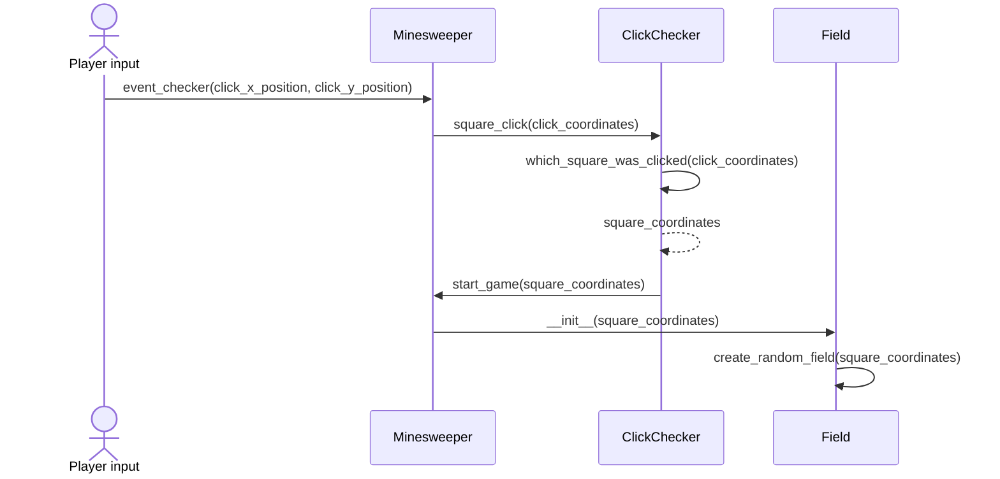

# Arkkitehtuurikuvaus

## Rakenne
Pelin pakkausrakenne on seuraava:

Services sisältää pelin logiigan koodia, ui sisältää käyttöliittymän koodia ja menu sisältää pygame-menun koodin. Assets sisältää pelissä tarvittavia kuvia. Enums sisältää enumerateja, joilla selkeytetään koodia. Repositories-hakemistossa taas on tietokannan ja sovelluksen rajapinnan koodia.

## Käyttöliittymä

Käyttöliittymä sisältää kaksi eri näkymää: asetukset ja pelin. Vaikka ui on erillinen hakemisto, vastaa se oikeastaan vain pelin piirtämisestä. Pygame-menu -kirjastolla on oma piirtometodinsa, joka käyttää minesweeperin ikkunaa. Tämä metodi sijaitsee Menu-luokassa.

Kun käyttäjä painaa menussa play, kutsutaan Minesweeper-luokan go_to_game -funktiota, joka vie käyttäjän peliin. Pelin sisällä taas voi painaa nappia "back to menu", joka vie käyttäjän takaisin menuun.

## Sovelluslogiikka

### Luokkakaavio

### Sekvenssikaavio

#### Pelaajan ensimmäinen klikkaus ruudukossa (Kaavio ei ole täydellisen kuvaava tilanteesta, mutta siinä kuitenkin tulee ilmi, mitä luokkia, metodeja ja muuttujia käytetään missäkin, ja miten muuttujat siirretään)

