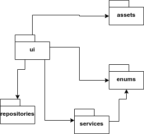
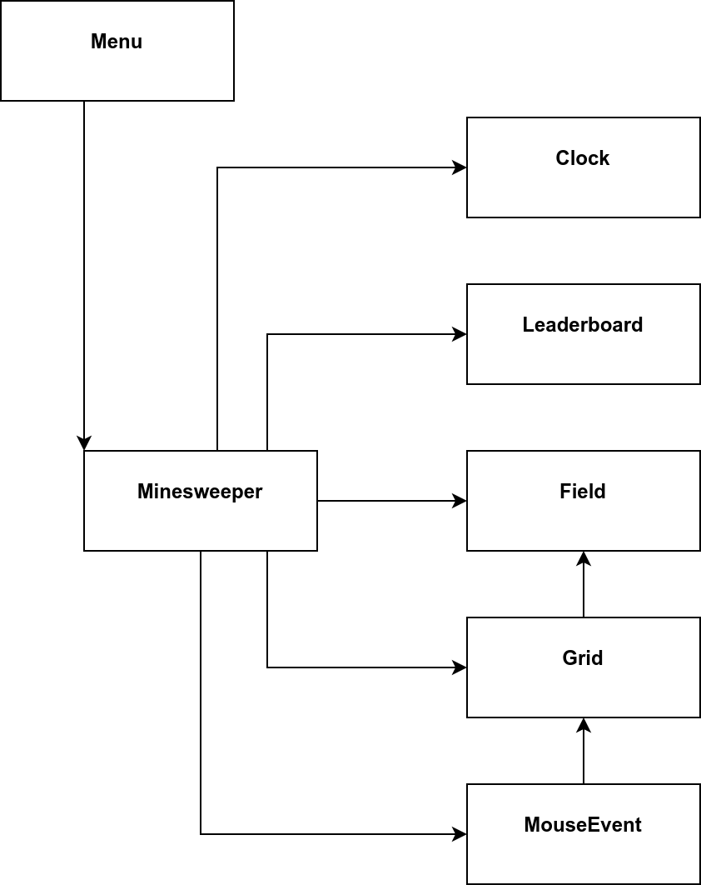
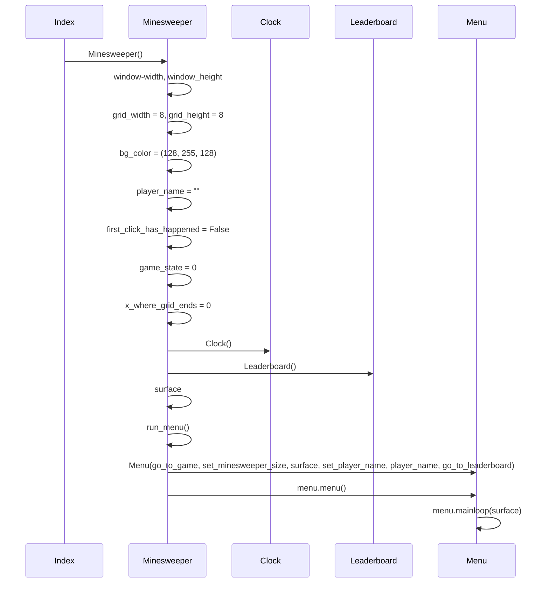
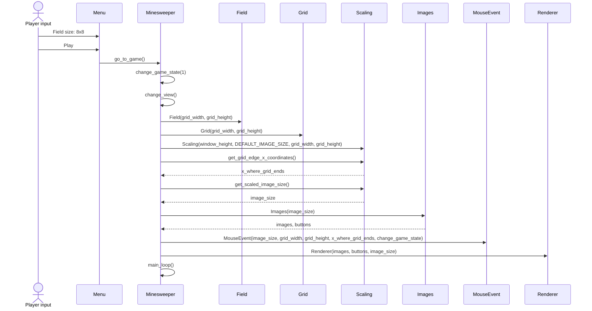
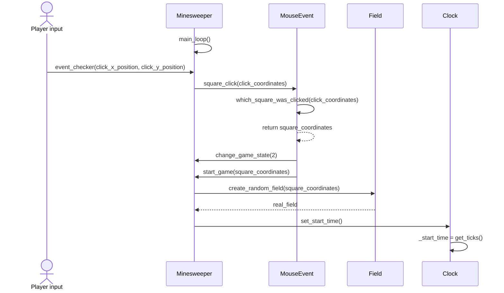
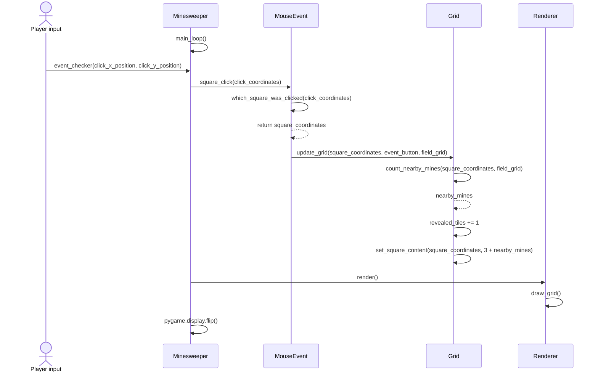
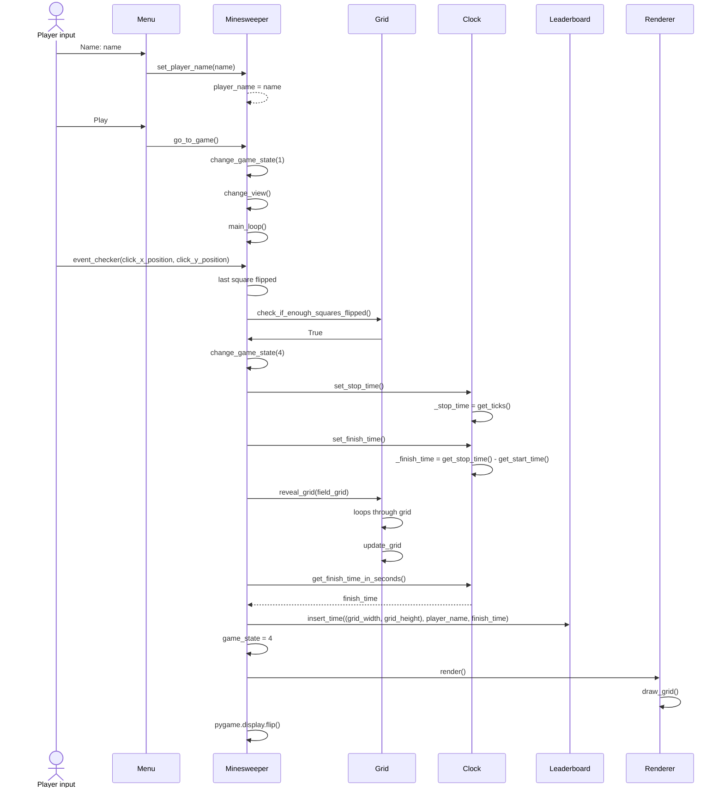
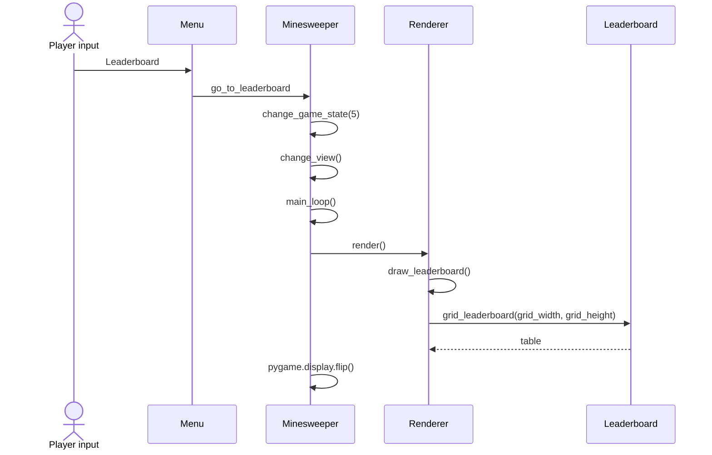

# Arkkitehtuurikuvaus

## Rakenne
Pelin pakkausrakenne on seuraava:

Ui sisältää pelin käyttöliittymän, menun, käyttäjän syötteet ja loopin. Services sisältää pelin logiikan koodia. Enums sisältää enumerateja, joilla selkeytetään koodia. Repositories-hakemistossa taas on tietokannan rajapinnan koodia.

## Käyttöliittymä

Käyttöliittymä sisältää kaksi eri näkymää: asetukset, tulostaulun ja pelin. Ruudulla on kerrallaan aina yksi näkymä. Pygame-menulla on oma looppinsa, mutta se käyttää minesweeper-olion ikkunaa. Pygamen loopissa kutsutaan Renderer-luokkaa, joka piirtää näytön.

Kun käyttäjä painaa menussa play, kutsutaan Minesweeper-luokan go_to_game -funktiota, joka vie käyttäjän peliin. Jos menussa painaa leaderboard, kutsutaan Minesweeper-luokan go_to_leaderboard -funktiota. Kummankin näkymän sisällä taas voi painaa nappia "back to menu", joka vie käyttäjän takaisin menuun.

## Pelin logiikka

Ohjelmassa annetaan ui:n Menu- ja Minesweeper -luokilta saatuja käyttäjän interaktiosta muodostuvia syötteitä servicesin luokille Grid, Field ja Clock.

### Luokkakaavio

Ensin luodaan minesweeper-olio, jonka displayn päälle Menu laittaa oman displaynsä. Menu-luokasta kutsutaan Minesweeper-luokan metodeja. Minesweeper-luokka käyttää kaikkia kaaviossa oikealla olevia luokkia. Luokka MouseEvent käyttää luokista Grid ja Field olioita, mutta se saa ne Minesweeper-luokan kautta injektiona. Luokka Grid myös käyttää samoin Field-oliota ja saa sen Minesweeper-luokalta.

Luokka Field esimerkiksi muodostaa MouseEventistä klikkikoordinaatin avulla satunnaisen miinaruudukon, jossa klikattu ruutu ei saa olla miina.

Luokka Grid taas saa päivittää näkyvältä ruudukolta MouseEventin antaman ruudun vastaamaan käyttäjän syötettä (vasen/oikea klikkaus, avaus/liputus) ja ruutua ympäröivien miinojen määrää.

Luokka Clock vastaa sekä pelin sekuntikellosta että fps:n asettamisesta. Luokan metodit ylläpitää pelin alkuaikaa, pelin nykyistä aikaa, pelin loppuaikaa ja laskee kuluneen ajan sekä läpäisemisen menneen ajan. Minesweeper-luokka kutsuu Clockin metodeja päästäkseen käsiksi aikoihin.

Luokka Leaderboard tallentaa ajat tulostauluihin. Minesweeper kutsuu Leaderboardia ja Clockia, ja tallentaa nimen ja ajan tietokantaan.

 

## Tiedon pysyväistallennus

Luokka Leaderboard tallentaa tietoa SQLite-tietokantaan.

Juurihakemistosta löytyy konfiguraatiotiedosto [.env](https://github.com/thefakejj/Minesweeper/blob/main/.env), jossa voidaan määritellä tiedostonimi, johon tulokset tallennetaan.

Ajat on taulussa muodossa (nimi TEXT, aika FLOAT).

Tiedot tallennetaan miinaharavan vaikeustasoihin jaettuihin tauluihin _8x8, _16x6 ja _24x16 tietokannassa, joka alustetaan [initialize_database.py](https://github.com/thefakejj/Minesweeper/blob/main/src/initialize_database.py)-tiedostossa.

 

## Keskeiset toiminnallisuudet
Tässä osassa on pelin ohjelman toimintaa kuvaavia yksinkertaistettuja sekvenssikaavioita. Jotkin sekvenssikaaviot ovat melko pitkiä, koska funktioihin injektoidaan monia asioita.

### Pelin avaus

#### Avaus alustaa pygamen ja antaa Minesweeperille kaikki oletusarvot

 

### Peliin meneminen

#### Käytetään esimerkkinä tilannetta, missä pelajaa valitsee ruudukon kooksi 8x8

 

### Ensimmäinen klikkaus

#### Pelaajan ensimmäinen klikkaus ruudukossa, joka muodostaa backissa miinaruudukon listana. Tässä vaiheessa ruudukon koko on jo valittu, ja se on Minesweeper-oliolla muistissa.

 

### Ruudukon päivittäminen

#### Tilanne, jossa miinojen sijainnit on jo generoitu, ruutua ei ole avattu ja ruutu ei ole miina.

 

### Pelin voittaminen, tuloksen tallentaminen

#### Tilanne, jossa pelaaja voittaa pelin

 

### Pelaaja menee tulostauluun

 

## Ohjelman rakenteeseen jääneet heikkoudet

Ohjelmassa on käyttöliittymää ja logiikkaa sekaisin, mikä esimerkiksi aiheuttaa tarpeen koodin toistolle, jotta testejä voidaan pyörittää.