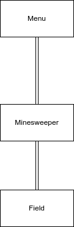
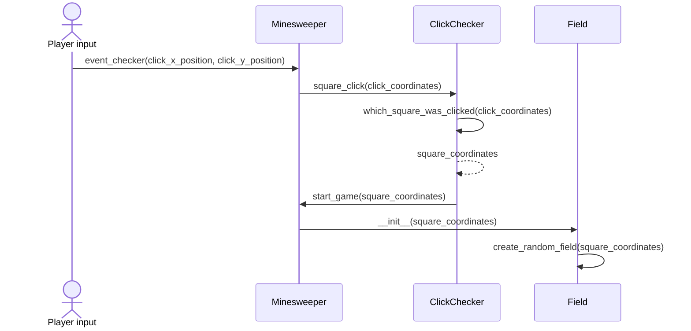

# Arkkitehtuurikuvaus

## Rakenne
Pelin pakkausrakenne on seuraava:

## Sovelluslogiikka

### Luokkakaavio

### Sekvenssikaavio

#### Pelaajan ensimmäinen klikkaus ruudukossa (Kaavio ei ole täydellisen kuvaava tilanteesta, mutta siinä kuitenkin tulee ilmi, mitä luokkia, metodeja ja muuttujia käytetään missäkin, ja miten muuttujat siirretään)

