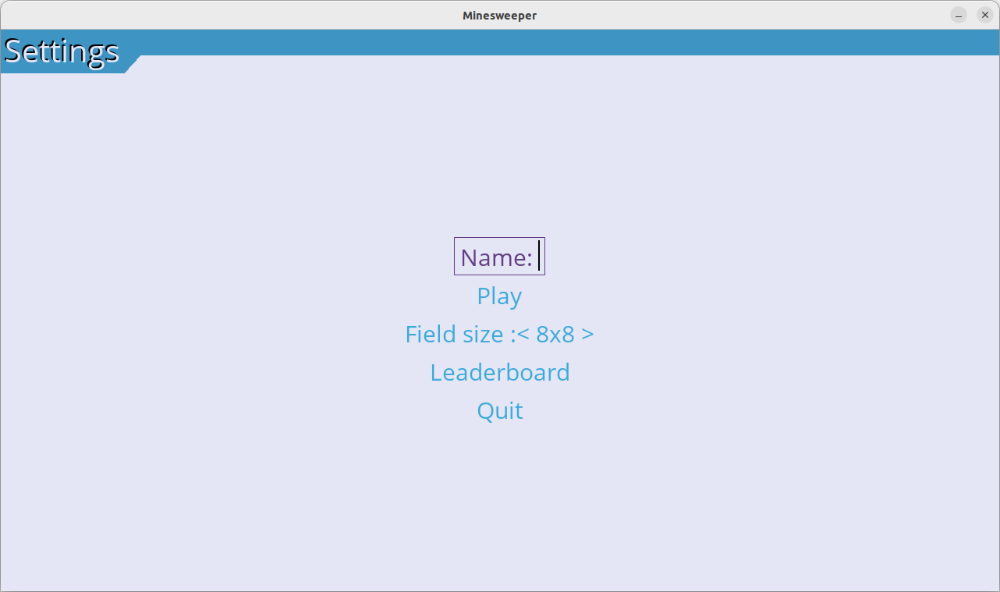

# Käyttöohje

Ohjelmaan tarvitaan vähintään pythonin versio 3.8. Ohjelma on julkaistu poetryn version 1.4.2 kanssa.

Kloonaa [repositorio](https://github.com/thefakejj/Minesweeper) koneellesi. (myöhemmin tähän release)

## Konfigurointi
Voit vaihtaa tietokantatiedoston nimen .env-tiedostossa, jolloin voit esimerkiksi käyttää useampia tulostauluja.
Tiedostot luodaan automaattisesti data-hakemistoon.
.env-tiedostossa tietokantatiedoston nimi määritellään seuraavasti:
```
DATABASE_FILENAME=databasename.db
```

## Ohjelman käynnistäminen

1: Mene virtuaaliympäristöön

```bash
poetry shell
```

2: Asenna riippuvuudet

```bash
poetry install
```

3: Luo tietokanta. HUOM: Tämä komento tyhjentää sen tietokannan, minkä tiedostonimi on .envissä! 

```bash
poetry run invoke build
```

4: Nyt kun ohjelma on asennettu, voit käynnistää sen komennolla:

```bash
poetry run invoke start
```


## Pelin pelaaminen

Jotta voit pelata peliä, sinun tulee asettaa jokin nimi "Name"-kenttään.


Kun olet valinnut nimen, voit aloittaa pelin klikkaamalla "Play".


Avaa ensimmäinen ruutu hiiren vasemmalla painikkeella, minkä jälkeen miinat satunnaisesti muodostuvat. Voit liputtaa ruudun oikealla painikkeella.


Kun klikkaat ruudusta, pelin kello käynnistyy. Pelin sisällä avaamasi ruutu näyttää sitä ympäröivien miinojen määrän. Tyhjä avattu ruutu vastaa nollaa ympäröivää miinaa. Voit palata valikkoon "Back to menu" -nappia painamalla. Peli muistaa nimesi, kun palaat menuun.


Jos paljastat miinan, häviät pelin ja kaikki liputtamattomat miinat paljastuu.


Jos onnisut paljastamaan kaikki miinattomat ruudut, voitat pelin ja kaikki liputtomat miinat paljastuu.


## Tulostaulu

Tulostaulua pääsee katsomaan menusta "Leaderboard"-painikkeesta. Näkymässä näkyy sen vaikeustason tulostaulu, mikä ollaan valittu menussa Field sizella.


Tietyn vaikeustason tulokset näkyvät tulostaulukossa näin:

Takaisin menuun pääsee "Back to menu" -painikkeesta.