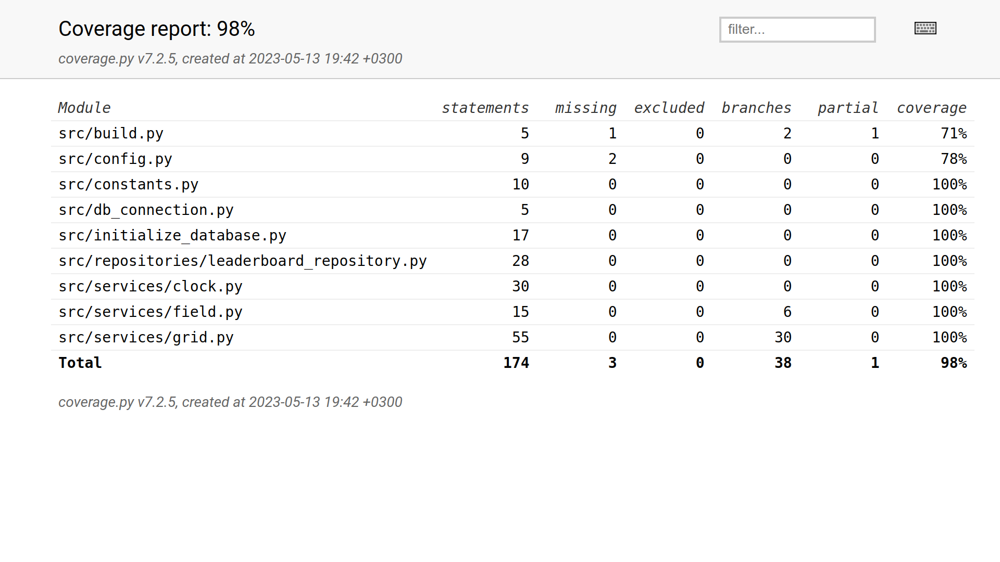

# Testausdokumentti

Ohjelma on testattu automaattisilla testeillä, joihin kuuluu yksikkö- ja integraatiotestejä. Ohjelmaa on myös testattu manuaalisesti. Järjestelmätestausta ei VIELÄ OLE TEHTY

## Yksikkö- ja integraatiotestaus

### Logiikka

Pelin kolmea logiikkaluokkaa testataan niiden omilla testiluokilla.

Luokan Clock toimivuutta testataan [TestClock](https://github.com/thefakejj/Minesweeper/blob/main/src/tests/services/clock_test.py)-luokalla. Testi alustetaan tekemällä Clock-olio.

Testit toimii kutsumalla tietyllä tick-nopeudella tick-metodia, ja katsomalla Clockin get-metodien palautuksia. Tämä testitapa toisaalta ei välttämättä aina toimi, koska ohjelman pyöritysnopeudessa voi olla eroa. Kuitenkin testiluokan nykyiset testit ovat aina menneet läpi kehittäjän tietokoneella. 

Luokan Field toimivuutta testataan [TestField](https://github.com/thefakejj/Minesweeper/blob/main/src/tests/services/field_test.py)-luokalla. Testiolio alustetaan asettamalla ruudukon leveys ja korkeus sekä klikattavan ruudun koordinaatit ruudukossa. Sitten luodaan Field-olio, jolle annetaan ruudukon koko, ja jolle luodaan satunnainen ruudukko käyttäen sen create_random_field-metodia.

Korkeus ja leveys testataan, mutta olennaisin testi on se, että lasketaan miinojen määrä. Miinojen määrä on noin 16%, joten 8x8-ruudukossa miinoja on 10.

Luokan Grid toimivuutta testataan [TestGrid](https://github.com/thefakejj/Minesweeper/blob/main/src/tests/services/grid_test.py)-luokalla. Tämän luokan testauksessa on myös integraatiotestejä. Testiolio alustetaan Luomalla Grid-olio 8x8-kokoisena. Sen lisäksi testioliolle annetaan yksi field-luokan ruudukkoa vastaava lista, johon on sijoitettu 10 pommia. Näiden lisäksi on tehty tyhjä Grid-olion taulukkoa vastaava taulukko, toinen Grid-olion taulukkoa vastaava taulukko, johon on sijoitetu liputettuja ja avattuja ruutuja. Integraatiota varten on luotu MouseEventin vaatimat valefunktiot funktioille change_game_state ja start_game, jotka ovat tiedoston lopussa globaalina. Viimeisenä luodaan MouseEvent-olio, joka vastaa 8x8 ruudukkoa. Tämä saa valefunktion change_game_state parametrikseen.

Metodi test_mouse_event_revealing_mine_reveals_grid testaa, avaako ohjelma kaikki avaamattomat ja liputtamattomat ruudut jos miinan paljastaa. Tähän käytetään apuna metodia count_unrevealed_tiles, jolla varmistetaan, että testin alussa avaamattomia ruutuja on 64, ja lopussa niitä on 0.

### Repositorio

Ohjelman ainoaa repositorioluokkaa Leaderboard testataan [TestLeaderboard](https://github.com/thefakejj/Minesweeper/blob/main/src/tests/repositories/leaderboard_repository_test.py)-luokalla.

.env.test-tiedostoon on juurihakemistossa asetettu tiedostonimi test_leaderboard.db, jota käytetään testeissä.

Testit alustetaan luomalla leaderboard-olio, jonka kaikki taulut tyhjennetään. Sen jälkeen testioliolle luodaan lista tupleja, jotka kuvaavat ruudukon kokoja ja samalla taulukoiden nimiä.

Testeissä insertoidaan suoraan tietoa ja varmistetaan, että haut ovat oikeita.

### Vakiot

Ohjelmassa on myös testit vakioille [TestConstants](https://github.com/thefakejj/Minesweeper/blob/main/src/tests/other/constants_test.py)-luokassa. Joskus kehityksen aikana vakioita tulee muutettua, joten tällä testillä helposti varmistetaan, että kaikki vakiot ovat oikein ennen julkaisua. Moni vakioista tulee testattua muissakin testeissä.

### Testikattavuus

Käyttöliittymää ja indeksin virheviestiä lukuunottamatta ohjelman testikattavuus on 98%

Testaamatta jäi buildin ajaminen komentoriviltä ja konfiguraation FileNotFoundError.

## Manuaalisesti testattu:

On testattu indeksistä se, että printataan pyyntö ajaa build, jos tietokantaa ei ole alustettu.

On testattu, että kaikki valikon napit toimii.

On testattu, että tyhjällä nimikentällä ei pääse peliin.

On testattu, että yli 20 merkin nimeä ei voi syöttää.

On testattu, että back to menu -nappi toimii pelin ja tulostaulun näkymissä.

On testattu, että peli toimii.

## Järjestelmätestaus

### Asennus ja konfigurointi

Ohjelma on testattu toimivan tilanteessa, joissa tietokanta on valmiiksi olemassa ja tilanteessa, jossa ohjelman tulee luoda tietokantatiedosto itse.

### Toiminnallisuus

Kaikki [vaatimusmäärittelyssä](https://github.com/thefakejj/Minesweeper/blob/main/documentation/vaatimusmaarittely.md) ja käyttöohjeessa listattu toiminnallisuus on käyty läpi.

## Sovellukseen jääneet ongelmat

On testattu manuaalisesti, että jos menussa nimeksi laittaa esimerkiksi emojin, ohjelma kaatuu. Tähän on yritetty löytää ratkaisua pygame-menusta, mutta tähän mennessä ongelma on edelleen olemassa.
