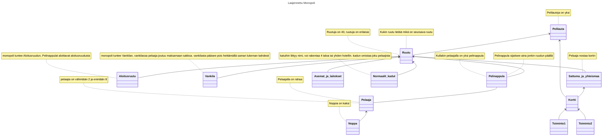

```mermaid
---
title: Laajennettu Monopoli
---
 classDiagram
    Pelilauta <-- Ruutu
    note for Pelilauta "Pelilautoja on yksi"
    note for Ruutu "Ruutuja on 40, ruutuja on erilaisia"

    Pelinappula -- Pelaaja
    note for Pelinappula "Kullakin pelaajalla on yksi pelinappula"
    note for Pelaaja "pelaajia on vähintään 2 ja enintään 8"

    Pelaaja <-- Noppa
    note for Pelaaja "Pelaajalla on rahaa"
    note for Noppa "Noppia on kaksi"

    Ruutu <-- Pelinappula
    note for Ruutu "Kukin ruutu tietää mikä on seuraava ruutu"
    note for Pelinappula "Pelinappula sijaitsee aina jonkin ruudun päällä"

    Pelilauta <-- Kortti
   
    Ruutu <-- Aloitusruutu
    note for Aloitusruutu "monopoli tuntee Aloitusruudun, Pelinappulat aloittavat aloitusruudusta"
    Ruutu <-- Vankila
    note for Vankila "monopoli tuntee Vankilan, vankilassa pelaaja joutuu maksamaan sakkoa. vankilasta pääsee pois heittämällä saman lukeman kahdesti"
    Ruutu <-- Sattuma_ja_yhteismaa
    Sattuma_ja_yhteismaa <-- Kortti
    note for Sattuma_ja_yhteismaa "Pelaaja nostaa kortin"
    Ruutu <-- Asemat_ja_laitokset
    Ruutu <-- Normaalit_kadut
    note for Normaalit_kadut "katuihin liittyy nimi, voi rakentaa 4 taloa tai yhden hotellin. kadun omistaa joku pelaajista"
    Kortti <-- Toiminto1
    Kortti <-- Toiminto2
```