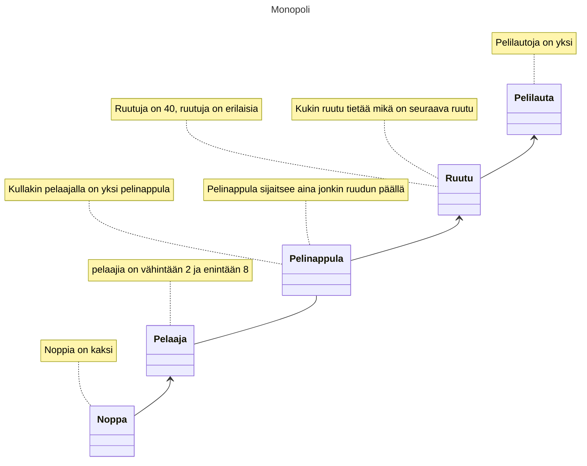

```mermaid
---
title: Monopoli
---
 classDiagram
    Pelilauta <-- Ruutu
    note for Pelilauta "Pelilautoja on yksi"
    note for Ruutu "Ruutuja on 40, ruutuja on erilaisia"
    Pelinappula -- Pelaaja
    note for Pelinappula "Kullakin pelaajalla on yksi pelinappula"
    note for Pelaaja "pelaajia on vähintään 2 ja enintään 8"
    Ruutu <-- Pelinappula
    note for Ruutu "Kukin ruutu tietää mikä on seuraava ruutu"
    note for Pelinappula "Pelinappula sijaitsee aina jonkin ruudun päällä"
    Pelaaja <-- Noppa
    note for Noppa "Noppia on kaksi"
```